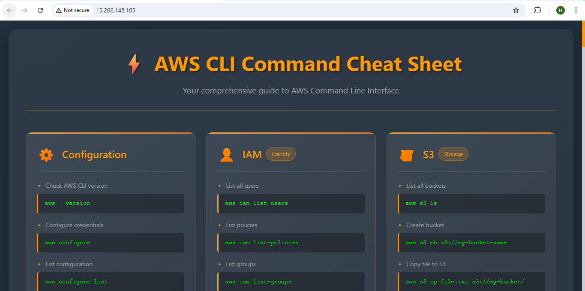
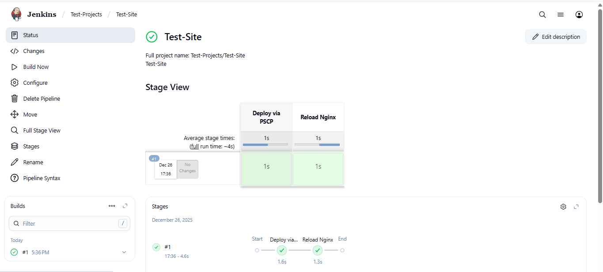

# 🔥 Jenkins Automation: From Windows to AWS EC2
## Deploy. Automate. Learn.

> **One Push. Jenkins Handles the Rest. Your Code Lands on AWS.**

This is NOT another boring tutorial. This is a real learning project where I figured out how to make Jenkins on Windows automatically deploy websites to AWS EC2 without touching the server manually.

**The Problem:** Manual deployments are slow, error-prone, and don't scale.  
**The Solution:** This automated pipeline that copies files, fixes permissions, and reloads your web server in seconds.

**The Reality:** It took debugging SSH keys, file paths, and Linux permissions to get it right. This repo is that journey.

---

## 🎯 What This Project Covers

This learning project demonstrates:

- **Jenkins Pipeline automation** on Windows
- **AWS EC2 (Ubuntu)** as the deployment target
- **SSH key-based authentication** for secure connections
- **PSCP** for secure file transfer
- **Plink** for remote command execution
- **Nginx** serving a static website
- **Automated deployment workflow** that combines everything above

The setup is intentionally minimal to keep focus on understanding the fundamentals rather than optimizing for production.

---

## 🧠 Why This Learning Project Exists

Working through this automation challenge revealed an important lesson:

> Automation isn't about memorizing tool syntax—it's about discipline in handling paths, permissions, credentials, and environment differences.

When Jenkins tries to copy files from Windows to a Linux server using SSH keys, every detail suddenly matters. This repository exists as a reference for those moments when small details become critical.

---

## 📁 Repository Structure

```
jenkins-deployment-learning/
│
├── Jenkinsfile                 # Pipeline configuration
├── html/                       # Static website files
│   ├── index.html
│
├── nginx/                      # Nginx configuration
│   └── testsite.conf
│
├── screenshots/                # Visual documentation
│   ├── image-1.png            # Jenkins pipeline execution
│   ├── image-2.png            # Website running on EC2
│   └── image-3.png            # Nginx configuration
│
├── .gitignore
└── README.md
```

---

## 📋 Prerequisites

### Local Machine (Windows)

- Jenkins installed and running as a Windows service
- Git installed
- PuTTY tools (specifically `plink.exe` and `pscp.exe`)
- AWS EC2 key pair file (.ppk format)

### AWS EC2 (Ubuntu 24.04)

- Port 22 (SSH) open in Security Group
- Port 80 (HTTP) open in Security Group
- Nginx installed and running
- Web directory created and configured

---

## 🚀 Quick Start Reference

### 1. EC2 Setup

Launch Ubuntu 24.04 instance and run:

```bash
sudo apt update
sudo apt install nginx -y
sudo systemctl enable nginx
sudo systemctl start nginx

sudo mkdir -p /var/www/testsite
sudo chown -R www-data:www-data /var/www/testsite
sudo chmod -R 755 /var/www/testsite
```

### 2. Nginx Configuration

Create `/etc/nginx/sites-available/testsite`:

```nginx
server {
    listen 80;
    server_name _;

    root /var/www/testsite;
    index index.html;

    location / {
        try_files $uri $uri/ =404;
    }
}
```

Enable and reload:

```bash
sudo ln -s /etc/nginx/sites-available/testsite /etc/nginx/sites-enabled/
sudo rm /etc/nginx/sites-enabled/default
sudo nginx -t
sudo systemctl reload nginx
```

### 3. Jenkins Pipeline Job

In Jenkins:
- Create a new **Pipeline** job
- Configure SCM: Point to this GitHub repository
- Branch: `main`
- Script path: `Jenkinsfile`

---

## 🧾 Jenkinsfile Breakdown

The pipeline performs two key stages:

**Stage 1: Deploy Website**
- Uses PSCP to securely copy HTML files from Windows to EC2
- Transfers all files from the `html/` directory to `/var/www/testsite`

**Stage 2: Reload Nginx**
- Uses Plink to execute remote commands
- Changes ownership to `www-data` user
- Reloads Nginx to serve updated content

---

## 📸 Learning Snapshots

### Jenkins Pipeline in Action

*Jenkins running the deployment pipeline, showing successful file transfer and Nginx reload stages.*

### Website Live on EC2

*The static website successfully deployed and accessible through the EC2 instance's public IP.*

### Nginx Configuration

*Nginx configuration file showing the virtual host setup for serving the static content.*

---

## 🔑 Important Security Notes

### ⚠️ What NOT to Commit to GitHub

| Item | Reason |
|------|--------|
| `.ppk` / `.pem` key files | Security risk—private keys must stay private |
| EC2 private/public IPs | Best practice for security through obscurity |
| Jenkins credentials IDs | Internal configuration |
| Passwords or secrets | Never commit sensitive data |


### 🛡️ Best Practices Used

- SSH key-based authentication (no passwords)
- Batch mode in PSCP/Plink (non-interactive)
- Host key verification
- Least privilege (www-data ownership)
- Security Group restrictions (SSH from specific IP only)

---

## 🧪 Verification Steps

### Test SSH Connectivity

From Windows PowerShell:

```powershell
"C:\Program Files\PuTTY\plink.exe" -i "path\to\key.ppk" ubuntu@<EC2-IP> "echo 'SSH works'"
```

### Test File Transfer

```powershell
"C:\Program Files\PuTTY\pscp.exe" -i "path\to\key.ppk" -r "local\path\*" ubuntu@<EC2-IP>:/var/www/testsite
```

### Test Website

```bash
curl http://<EC2-IP>
```

Expected response: `HTTP/1.1 200 OK`

Open in browser: `http://<EC2-IP>`

---

## 💡 Key Learnings

Through this project, I discovered:

1. **Path handling matters** — Windows uses backslashes, Linux uses forward slashes. Jenkins environment variables help bridge this.

2. **Permissions are strict** — Linux file ownership and permissions need careful handling, especially for web servers.

3. **SSH keys are better than passwords** — Automation needs non-interactive auth; keys are the way.

4. **Small details break automation** — A missing newline, a wrong user, a forgotten sudo command—these details stop deployments cold.

5. **Batch mode is essential** — Running SSH tools in batch mode prevents Jenkins from hanging waiting for user input.

---

## 🔄 Deployment Workflow (How It Works)

```
Developer commits → GitHub
         ↓
    Jenkins detects change
         ↓
    Jenkinsfile triggers
         ↓
    PSCP copies files (Windows → EC2)
         ↓
    Plink changes permissions & reloads Nginx
         ↓
    Website updated ✓
```

---

## 📚 Related Learning Areas

This project touches on:

- **CI/CD concepts** — What makes automation reliable
- **Infrastructure basics** — VMs, Security Groups, SSH
- **Linux fundamentals** — File permissions, systemd, user management
- **Web servers** — Nginx configuration and virtual hosts
- **DevOps mindset** — Infrastructure reproducibility and documentation

---

## 🚫 What This Project Is NOT

- **Not production-ready** — This is a learning exercise with simplified security
- **Not a best practices guide** — There are better ways to handle credentials and deployment
- **Not optimized** — Code and configuration prioritize clarity over efficiency
- **Not complete** — Real CI/CD needs Docker, artifact repositories, rollback support, etc.

---

## 🎓 Next Steps for Learning

If you're following this learning path, consider exploring:

- **Docker** — Containerize the Nginx application
- **Terraform** — Infrastructure as Code for EC2 provisioning
- **GitHub Actions** — Alternative to Jenkins hosted directly in GitHub
- **HTTPS/SSL** — Certbot for Let's Encrypt certificates
- **Blue-Green Deployment** — Zero-downtime updates
- **Monitoring & Logging** — CloudWatch or ELK stack

---

## 📝 Notes

- This repository represents a point-in-time learning experience
- Commands and configurations have been tested on Windows 10/11 + Ubuntu 24.04
- AWS regions used: `ap-south-1` (Mumbai)
- Jenkins version used during learning: Latest LTS
- Nginx version: 1.24+

---

## ✍️ Author's Reflection

This project started as a simple question: *"How do I automate file transfers from Jenkins on Windows to a Linux server?"*

It became a lesson in the details that separate working automation from brittle automation. Every parameter, every permission, every file path—they all matter.

If you're learning automation, this repository is proof that the fundamentals are learnable, and the first attempt doesn't need to be perfect. It just needs to work, teach you something, and prepare you for the next challenge.

---

## 📄 License

This learning project is open for reference and education.

---

**Last Updated:** December 2025  
**Status:** Complete learning reference ✓